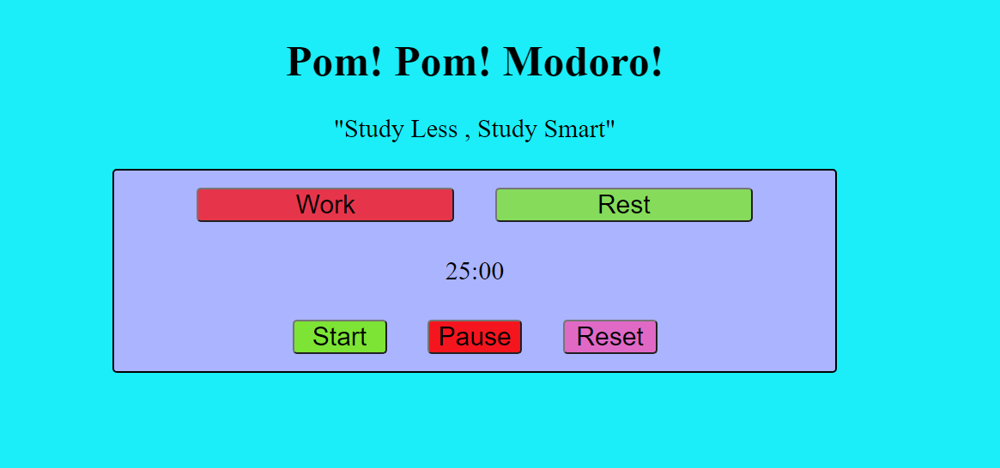
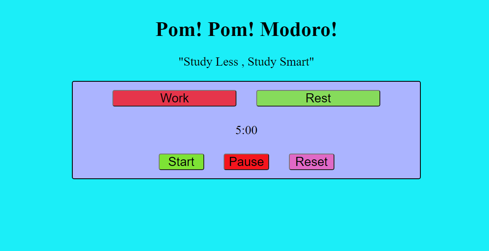

## Pomodoro Timer

A simple Pomodoro Timer using basic HTML, CSS, and JavaScript

Try it out [here](https://fritzchips.github.io/Pomodoro/)

## Instructions

Set Timer with Work and Rest

- Work : 25 minutes

- Rest : 5 minutes

- Alarm : Occurs when time reaches 0

- Stop : Will change Pause button during alarm and swap Work to Rest and vise versa

- Start : Start timer

- Pause : Pause timer

- Reset : Reset timer

## Summary

My first project in Software Development Mastery Program to develop a strong balance between studying and resting. This project helped me practice basic JavaScript functionality and start my process in writing clean code.

## Author

---

- **Fritz Solibio** - _Software Developer_ [LinkedIn](https://www.linkedin.com/in/fritz-solibio-4aa9b321b/) | [Website](https://www.fritzsolibio.ca/)
